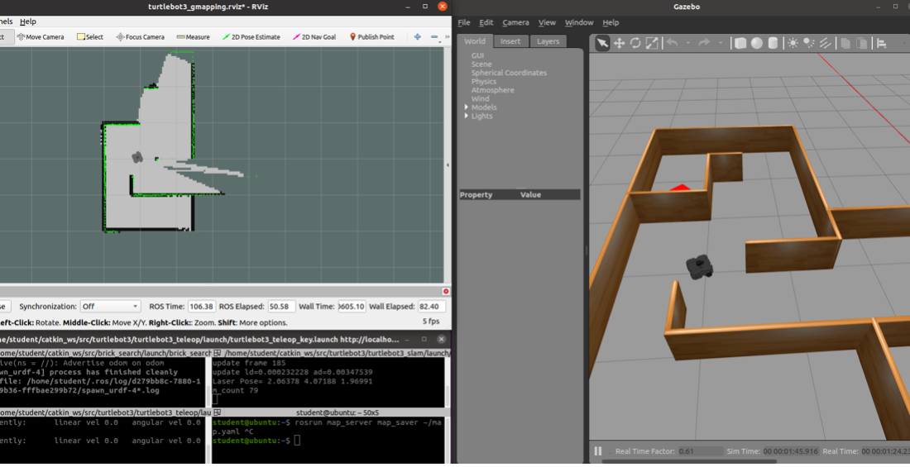
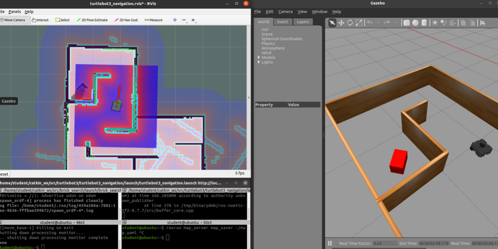
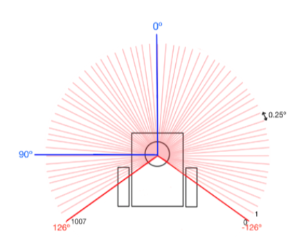
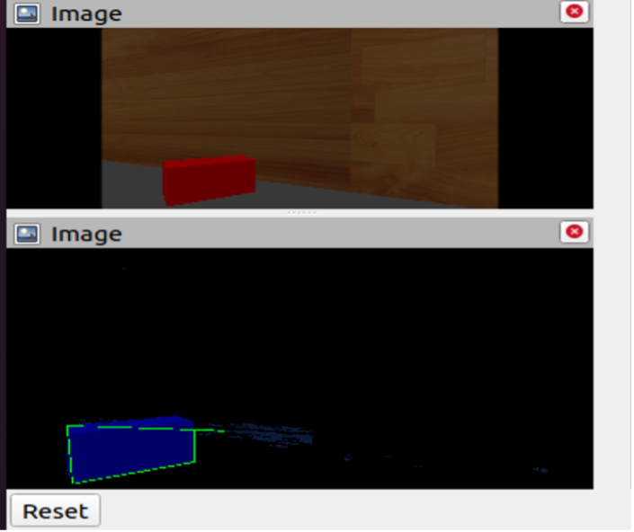

# TurtleBot3 Red Brick Finding

The aim of this project was to establish control of the TurtleBot and to combine this control with multiple concepts including navigation, image analysis, SLAM and exploration. By implementing these techniques, the goal of the TurtleBot is to autonomously explore either an unknown or pre-explored maze environment, utilising onboard sensors to detect red brick.
This project has many phases, including: map construction, localization, and recognization and decision making.  

  

## 2D Map Construction and Exploration

        roslaunch brick_search brick_search.launch
        roslaunch turtlebot3_slam turtlebot3_slam.launch slam_methods:=gmapping 
        roslaunch turtlebot3_teleop turtlebot3_teleop_key.launch 
        

  

## Localization and Navigation with a pre-built map 

Using the map generated from previous phase, the robot will determine its location and orientation based on the loaded map. The algorithm was based on Particle Filter, which I already tried to implement (visit for more detail)

  

## Decision-making

The technique used for this task was a wall-following algorithm which allows for autonomous navigation of the TurtleBot which is particularly effective in a close, walled maze environment. To accomplish this, only three states are required:
0: ‘find the wall’
1: ‘turn left’
2: ‘follow the wall’

  

For the TurtleBot 3 Waffle, Lidar sensor gives the distance for each degree (total 360). Region areas are established and refreshed making use of the laser callback to know where the walls are relative to the robot. 
After testing few times, three important regions used to compute prediction steps are front, front right, and front left areas, which can help the robot moving smoother. When a mobile robot is engaged in a wall-following algorithm, it may come across diverse wall shapes, including straight walls, inner corners, and outer corners. In most indoor environments, these three types of walls are commonly encountered. Recognizing inner and outer corners is a key factor in determining when to execute return actions to maintain a specific side of the wall.     

## Recognition

The subsequent step involves loading and converting the image to the HSV colour space. Within this colour space, it becomes imperative to establish the lower and upper thresholds of the colour range intended for detection. The OpenCV library's 'inRange()' function proves instrumental in isolating the pixels that fall within this defined colour range. This process ensures that only those pixels falling within the specified colour range are retained and extracted for further analysis. 
The contours of the square shape are extracted, with the overall cube’s shape being approximated based on these contours. Lidar range data is also used to compute the size of the obstacle.  

  

  

For more information, refer here:
* https://github.com/ethz-asl/kalibr/wiki/IMU-Noise-Model
